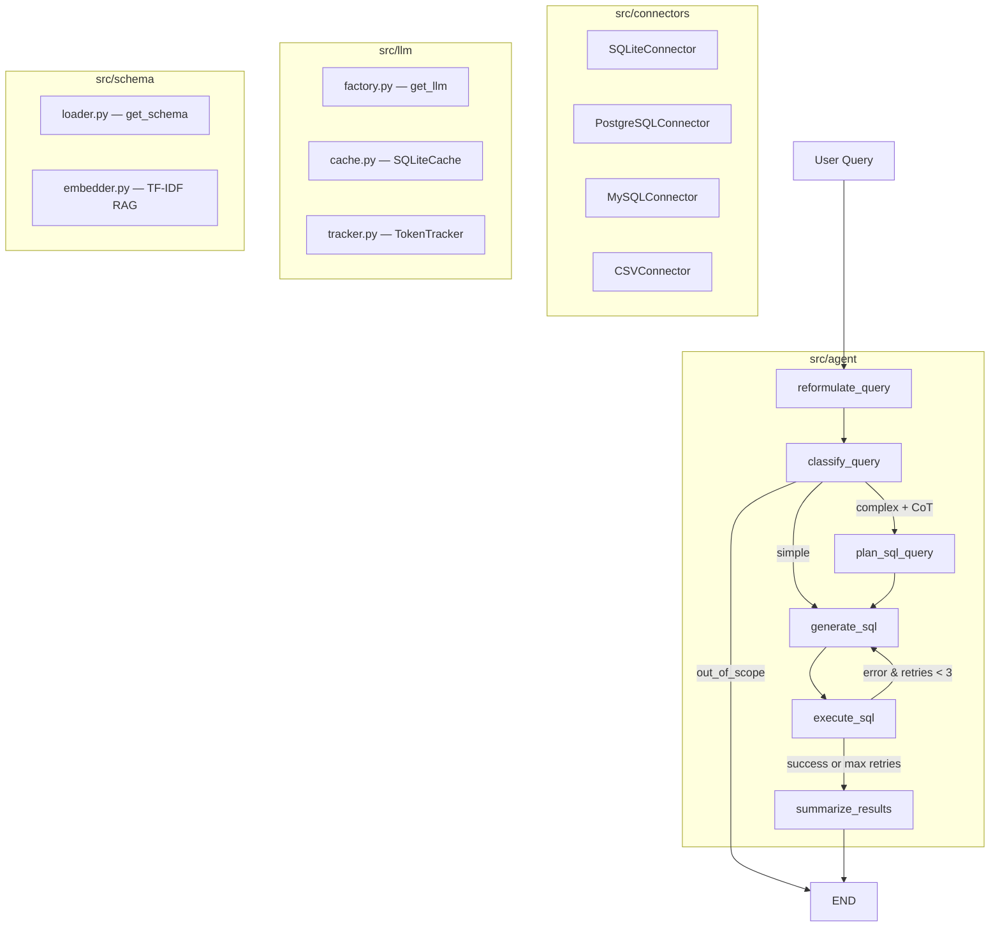

# 🤖 Text-to-SQL multi-agent architecture evaluation


## 📌 Project overview
This repository contains the source code and experimental framework for evaluating multi-agent architectures in text-to-SQL tasks. It was developed as part of a final thesis project.

The core objective is to evaluate how advanced prompt engineering techniques—specifically **few-shot learning**, **chain of thought (CoT)**, and **self-correction**—impact the performance and reliability of an LLM (powered by multiple providers and `LangGraph`) when querying a complex, real-world relational database.

## ✨ Features

| Feature | Description |
|---------|-------------|
| 🧠 Multi-LLM | OpenAI, Anthropic Claude, Google Gemini — switchable from sidebar |
| 🔍 RAG Schema Linking | TF-IDF retrieval injects only relevant schema tables into prompts |
| 🗄️ Multi-Database | Connect SQLite files, CSV uploads, PostgreSQL, or MySQL |
| 💾 LLM Caching | SQLite-backed response cache; toggleable from sidebar |
| 💰 Cost Tracking | Real-time token usage and USD cost estimate per session |
| 🗂️ Schema Explorer | Expandable sidebar panel with column types and sample rows |
| 💡 Smart Suggestions | 5+ clickable example questions generated on first load |
| 📜 Persistent Sessions | Save, load, rename, and delete named chat sessions |
| 📊 Export | Download data as CSV, chart as PNG, or full session as PDF |
| 🐳 Docker | One-command deployment with `docker compose up` |

## 🏗️ Architecture



## 🗄️ The dataset
The agent is tested against the [Brazilian e-commerce public dataset by Olist](https://www.kaggle.com/datasets/olistbr/brazilian-ecommerce). This realistic dataset contains 100,000 anonymized orders from 2016 to 2018.
- The database schema consists of 9 interconnected tables (orders, customers, products, reviews, etc.).
- An in-depth **Exploratory Data Analysis (EDA)** and Entity-Relationship Diagram (ERD) can be found in the `notebooks/` directory to justify the architectural choices.

## 🏗️ Project structure
```
src/
  agent/         # LangGraph state machine (nodes, graph, routing)
  connectors/    # Database connectors (SQLite, PostgreSQL, MySQL, CSV)
  llm/           # LLM factory, caching, token tracking
  prompts/       # System prompts and few-shot examples
  schema/        # Schema loader and TF-IDF RAG embedder
  storage/       # Persistent session history store
  ui/            # Streamlit UI components (schema explorer, suggestions)
eval/            # Evaluation dashboard and benchmark
scripts/         # DB build and schema extraction utilities
tests/           # Unit and integration tests
```

---

## ⚡ Quick Start (Docker)

The fastest way to run the app — no Python setup required.

**Prerequisites:** [Docker Desktop](https://docs.docker.com/get-docker/) installed.

```bash
# 1. Clone the repository
git clone https://github.com/candide-hounsou/sql-agent-fork-from-Adam-Faik-.git
cd sql-agent-fork-from-Adam-Faik-

# 2. Configure API keys
cp .env.example .env
# Edit .env and add your OPENAI_API_KEY (and optionally ANTHROPIC_API_KEY / GOOGLE_API_KEY)

# 3. Start the app
docker compose up --build

# 4. Open in browser
# http://localhost:8501
```

> **Note:** The `data/` directory is volume-mounted so your database, LLM cache, and session history persist across restarts.

---

## 🔧 Manual Setup

**1. Clone the repository**
```bash
git clone https://github.com/candide-hounsou/sql-agent-fork-from-Adam-Faik-.git
cd sql-agent-fork-from-Adam-Faik-
```

**2. Create a virtual environment**
```bash
python -m venv .venv
source .venv/bin/activate  # On Windows use: .venv\Scripts\activate
```

**3. Install dependencies**
```bash
pip install -r requirements.txt
```

**4. Environment variables**
```bash
cp .env.example .env
# Edit .env and set OPENAI_API_KEY (minimum)
# For Anthropic: ANTHROPIC_API_KEY
# For Google Gemini: GOOGLE_API_KEY
```

**5. Initialize the database**
```bash
python scripts/build_db.py      # Build SQLite from Olist CSV files
python scripts/build_schema.py  # Extract schema.txt + build RAG index
```

## 🎯 Usage

**Run the interactive agent app:**
```bash
streamlit run app.py
```

**Run the evaluation dashboard:**
```bash
streamlit run eval/eval_app.py
```

**Run tests:**
```bash
pytest tests/
```

## 🔌 Connecting your own database

| Type | How to connect |
|------|----------------|
| **SQLite file** | Sidebar → Upload SQLite / CSV → upload `.db` file |
| **CSV** | Sidebar → Upload SQLite / CSV → upload `.csv` file |
| **PostgreSQL** | Sidebar → Connection String → fill host/port/user/password |
| **MySQL** | Sidebar → Connection String → fill host/port/user/password |

## 🔬 Key findings
Through rigorous ablation studies, this project demonstrates that while self-correction significantly reduces syntax errors (SQLite exceptions), complex relational joins still require robust schema linking and few-shot examples to prevent semantic hallucinations.

---
*Developed for academic training purposes.*